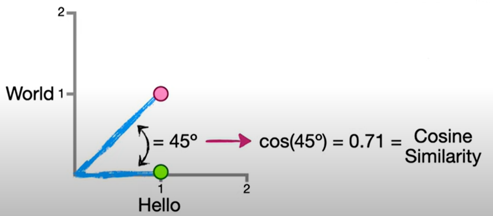

<p align="center">
  <a>
    
  </a>

<h2 align="center">University of Prishtina : Faculty of Electrical and Computer Engineering</h2>
<h3 align="center">Course: Diesign and Analysis of Algorithms</h3>
<h2 align="center">Project: Recommender System with Collaborative Filtering</h2>
<p align="left">Professor: Avni Rexhepi</p>
<p align="left">Assistant: Adrian Ymeri</p>

<p align="left">Students: Jon Kuçi, Kaltrina Krasniqi, Erza Gashi, Edon Gashi</p><br><br>

</p>

## Project summary

This program is a recommendation system using collaborative filtering. The program takes as input 3 JSON files, which contain a list of users, a list of books, and a dataset describing the ratings users give to books. The program can determine which books a specific user might like the most, based on the ratings they have given to other similar books. To achieve the most accurate results, calculations are performed using two methods: `Cosine Similarity` and `Pearson Similarity`, and their average is computed.
<br><br>

 <br>
## How to Configure
To execute, simply run the `main.py` file, which contains the mergeItemAndUserBased method within the MergingItemAndUserBased class. This method accepts 4 inputs:

 - `userId`: the ID of the user for whom you want to predict which books they might like.
 - `data`: the input dataset.
 - `numberOf`: the number of books listed in the result
 - `automatic`: if set to true, it automatically adjusts the weight of the result calculated with cosine similarity relative to the result from Pearson similarity (depending on the number of ratings users have given for the books). If set to false, an additional value (the alpha coefficient) must be provided, which indicates the level of importance cosine similarity will have in the final result.

After this method is executed, a list of books will be displayed that the user with the specified ID might like based on their previous preferences. The list is sorted by similarity to the liked books and the ratings those books have received.
<br><br>

## Cosine similarity
Cosine Similarity is a metric used to measure the similarity between two non-zero vectors in an inner product space. It calculates the cosine of the angle between two vectors, with values ranging from 0 to 1:

 - 1 indicates that the vectors are identical.
 - 0 indicates that the vectors are orthogonal (no similarity).
This metric is widely used in recommendation systems to find similarities between users, items, or ratings.

In this approach, the items we want to compare are represented as vectors, and using mathematical formulas, we calculate the angle between them. The cosine of that angle indicates how similar the items represented by those two vectors are.

Let's take an example of representing two sentences as vectors and finding the similarity between them.
 - Sentence A: "Hello, world"
 - Sentence B: "Hello, Hello"

We create a table where the first column contains the two sentences, and the first row lists each word from both sentences. The table is filled with values indicating how many times each word appears in the respective sentence.


|                | Hello          | World         |
|----------------|----------------|---------------|
| Hello, world   |        1       |       1       |
| Hello hello    |        2       |       0       |

<br>
<p align="center"> The cosine similarity between first sentence (red point) and secound sentence (green point)
  <br>
<a>
    
  </a>
  </p>
<br><br>

Or we can find the same value with other formula:

$$
\text{Cosine Similarity} = \frac{\sum_{i=1}^n A_i B_i}{\sqrt{\sum_{i=1}^n A_i^2} \cdot \sqrt{\sum_{i=1}^n B_i^2}}
$$


Given the vectors:

$$
A = [1, 1], \quad B = [1, 0]
$$

$$
\text{Cosine Similarity} = \frac{(1 \times 1) + (1 \times 0)}{\sqrt{1^2 + 1^2} \cdot \sqrt{1^2 + 0^2}} = \frac{1}{\sqrt{2} \cdot 1} = 0.71
$$

Thus, the cosine similarity between the vectors \(A\) and \(B\) is approximately 0.71.

<br>

In this form we calculate the cosine similarity of books 

## What we build out of it ?
In this way, we have compared books "Item Based" to determine how they are similar by calculating the cosine similarity between the sentences found in the attributes of the books (title, author, genres, and description). The results of the comparisons have been placed in 4 matrices (one matrix for each attribute).
One matrix looks like this:<br>

|                | Book n+1       | Book n+2      | ...           | Book n+m      |
|----------------|----------------|---------------|---------------|---------------|
| Book 1         |        1       |      0.72     |       .       |      0.86     |
| Book 2         |      0.91      |       1       |       .       |      0.77     |
| Book 3         |      0.65      |      0.89     |       .       |      0.45     |
| ...            |       .        |       .       |       .       |      .        |
| Book n         |      0.74      |      0.56     |       .       |      0.68     |

From `1` to `n` are books that the user rated, and from `n+1` to `n+m` are the books that the user has gived rating."

For each book that user has not gived any rate, from this table we calculate an average of similarity with all other rated books, indicated by the rate that user has gived to rated books. This means that we build a vector that has the value for each unrated books. We did this for 4 matrixes so this means that we have 4 vectors (for 4 books atribures). 
Then we combined these 4 vectors, taking into account the importance of each attribute (title, author, genres, description, each having a value from 0 to 1, and many of them having a value of 1). So, we ended up with a single vector.

We combined this vector with the vector obtained from the calculations with Pearson similarity (which is user-based), but the combination happens in such a way that their effect on the final result depends on the number of ratings given by users in comparison to the number of books. This is described by the coefficients `alpha` and `beta`.


## Efficiency of the program
Besides being very functional, this program is also efficient. Considering the number of calculations required by a matrix, and the programming language we used, we found it reasonable to perform some of the calculations in the C programming language. For more than that, the calculations were done with AXV registers. This ensures an increase in calculation speed.

In operations where addition or multiplication between vector elements was required, we used registers that hold 4 variables, and the addition or multiplication of the 4 variables is done simultaneously. Therefore, loops for iteration have an increment step of +4.

1. Clone this project:
   ```bash
   git clone https://github.com/JonKuqi/Recommender_System_with_Collaborative_Filtering_Gr16.git
<br><br>
   <a href="#top">Return in the top of page ↑</a>
